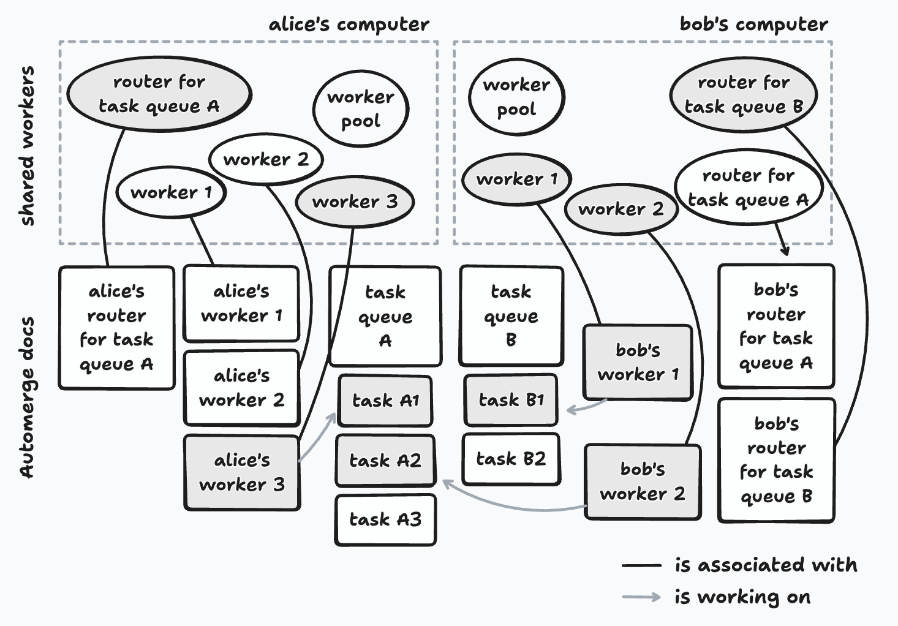

# Implementing a Local-First Task Framework

In the first lab note in this series, I introduced the task framework and motivated it with a few examples. In this note, I'll give you a more concrete picture of the framework — the set of concepts you need to understand in order to use it — and walk you through its implementation.

## Cast of characters

Each **user** has a **pool of task workers** that can run **tasks** from a set of **task queues** that user contributes work to.

A task is a unit of work. It has some code to run, an optional input, and a history of _runs_ (success/failure, logs, and timing information). All of this information is stored in an Automerge document, the URL of which serves as the task's id. Some tasks may generate a result, while others run for their side effects, e.g., modifying a Patchwork document.

Task queues enable users to organize tasks that are related in some way. As an example, there may be a task queue for just tasks that _index_ Patchwork documents — this is where the embedding generation tasks from my previous note would go, and every user in Patchwork would contribute compute to this task queue. Some task queues are long-lived while others may be created for a specific purpose that is only temporary, e.g., the scenario-generation tasks for a particular Ambsheet.

Task queues, like tasks, are represented as Automerge documents. This gives the task framework some useful mechanisms to coordinate the work that is done by the users' task workers, which I'll describe in the next section.

The final piece of the framework is the **task router**, whose job is to assign tasks that belong to a specific task queue to users' task workers. A user creates a router for each task queue they contribute to, but only one router is _active_ for a given task queue at any point in time. (More on this later.)

<figure>
  
  <figcaption>
    Alice contributes to task queue A; Bob contributes to both task queues A and B. Shaded workers are currently executing a task; arrows show which task they're working on.
  </figcaption>
</figure>

Note that the shared workers for the task workers and routers each have a corresponding Automerge document. These documents serve two purposes: (i) they give each shared worker a globally unique id that the rest of the system can refer to, and (ii) they provide a communication channel between shared workers via [Automerge Repo](https://automerge.org/blog/automerge-repo/)'s [_ephemeral messages_](https://automerge.org/automerge-repo/classes/_automerge_vanillajs..DocHandle.html#broadcast). This is useful because SharedWorkers can't communicate with each other directly — messages between them would have to be brokered by the worker pool proxy. Ephemeral messages enable communication between the shared workers regardless of whether they are running on the same computer or on different ones, without any additional messaging infrastructure.

## Coordination

These pieces don't coordinate themselves — and doing it correctly, especially in the face of users going offline and coming back, is the central design challenge of the framework. Here's how it works.

A user's worker pool, task workers, and routers all run as `SharedWorker`s to ensure that each of them has its own thread of execution and separate memory space. These are all created by an object known as the _worker pool proxy_ that is instantiated by a tool in Patchwork.

Note that each tab in the user's web browser that is running Patchwork will have its own worker pool proxy, but opening a new tab won't multiply the number of task workers or routers. This is because the names of these `SharedWorker`s are deterministic — e.g., `task-worker-1` and `task-worker-2` — and so the browser will reuse existing workers rather than create new ones with the same name.

### The Worker Pool and its Workers

The `SharedWorker`s for the worker pool and its workers are created by the worker pool proxy. The following are the responsibilities of the worker pool:

1. **Joining task queues.** If the user wants to contribute to another task queue, the worker pool must _join_ it. This involves opening a handle on the task queue's Automerge document, which contains the list of pending tasks as well as the id of the task queue's active router.

2. **Registering task workers.** When a task worker starts running, it creates an Automerge document for itself, which will contain information such as which task it is currently working on. It sends the URL of this document to the worker pool with an `add worker` message. (`SharedWorker`s can't communicate with each other directly, so this message is actually sent to the worker pool proxy, which then forwards it to the worker pool's `SharedWorker`.) When it receives this message, the worker pool opens a handle on the worker's document. Now it can keep track of what the worker is up to, tell if it's idle, etc.

3. **Keeping the active router of each task queue informed.** The worker pool periodically sends _heartbeat_ messages to each task queue's active router to let it know what its own task workers are up to. The active router uses these messages to piece together a global picture of the state of the task workers so that it can assign pending tasks to the ones that are idle.

### Routers and the "Takeover Protocol"

We've already seen how a task queue's active router finds out which workers are available to take on tasks. But what happens when the active router goes offline? How does an inactive router become the next active router?

Recall that a user runs a router for each of the task queues they contribute to. Each router subscribes to [_ephemeral messages_](https://automerge.org/automerge-repo/classes/_automerge_vanillajs..DocHandle.html#broadcast) from its associated task queue's Automerge doc. The active router for that task queue will periodically send _heartbeat_ messages through this channel. The other (inactive) routers will receive these messages and record the timestamp of the last heartbeat they received from that router.

An inactive router will periodically check the last timestamp it has received from the task queue's active router. If it's been a while (on the order of a few seconds in the current implementation), that router will assume that the active router has gone offline and attempt to take over as the new active router.

This involves:

1. Updating the task queue's Automerge document to record itself as the active router.
2. Waiting briefly so that the write can propagate to other peers.
3. Checking if it's still the active router, according to the task queue's Automerge document. If so, it will start to (i) broadcast heartbeat messages to the other routers associated with its task queue, and (ii) route pending tasks to idle workers.

All of the remaining routers will race to take over as the new active router. The information recorded in the task queue's Automerge document is authoritative; any router that believes itself to be active re-checks that document frequently, and will stop routing tasks immediately if it sees that the document says otherwise.

It's worth pausing on one consequence of this design: the framework guarantees that each task will eventually run, but does not guarantee that it will run only once. This is a deliberate tradeoff. When a takeover happens, it's possible for more than one router to briefly think that it's active, which can lead to the same task being assigned to different workers. So long as tasks are idempotent, redundant executions are not a problem.

The same dynamic plays out when a user goes offline. Routers belonging to users who are still online will notice that the offline user's router has gone quiet and, if it was the active one, another will take over. But from the offline user's router's point of view, it's the other routers that disappeared — so it will take over as active for its task queues too. This is essential: without it, any tasks added by that user while offline would never be serviced.

## Up Next

In the next lab note in this series, I'll introduce `tasklib`, the TypeScript library through which we interact with the task framework — creating and joining task queues, submitting tasks, and checking on their status.
